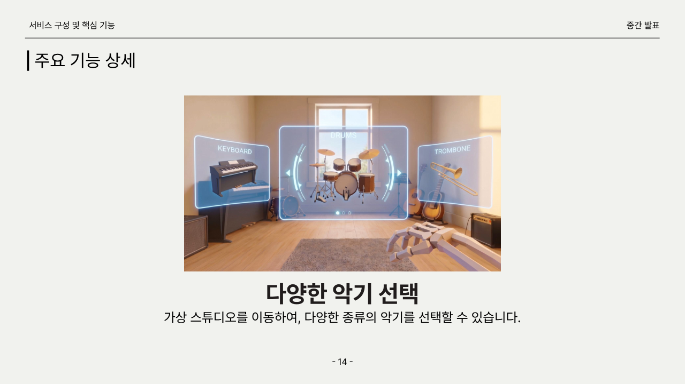
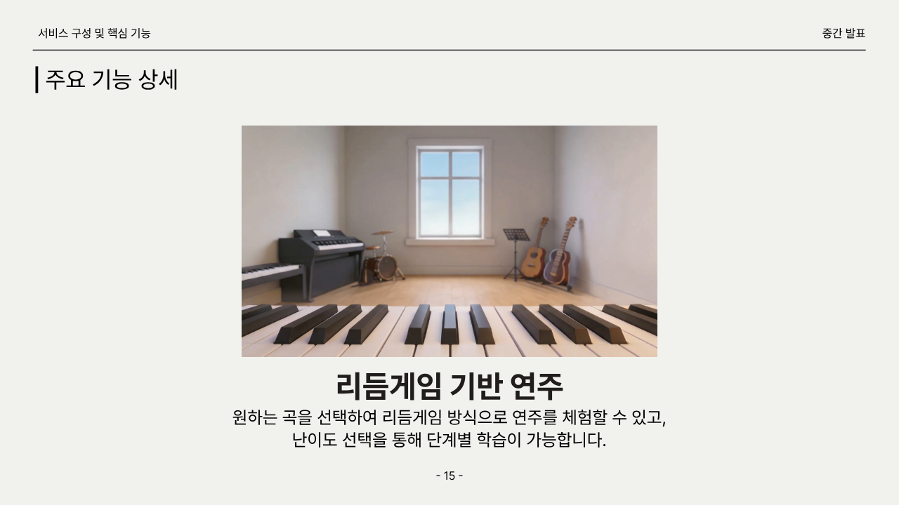
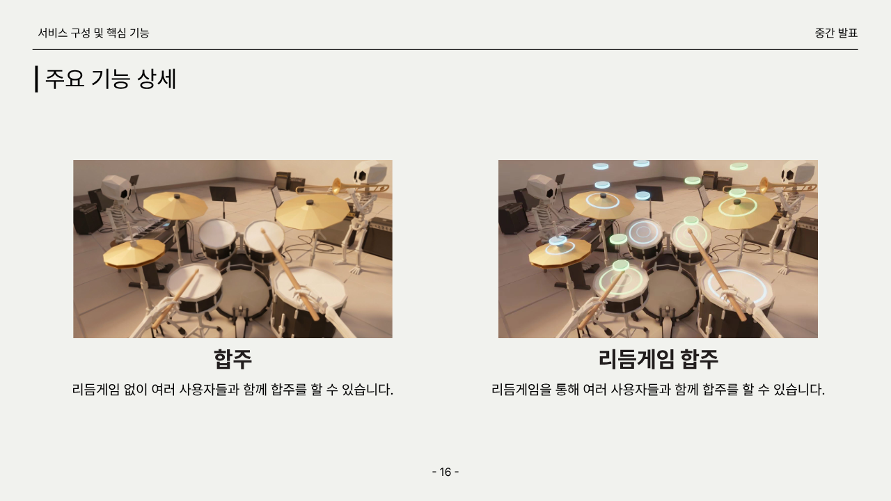
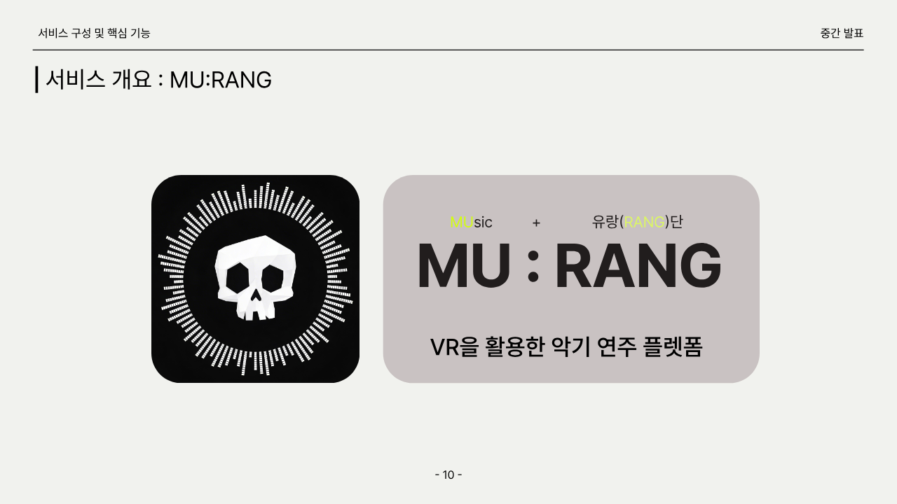
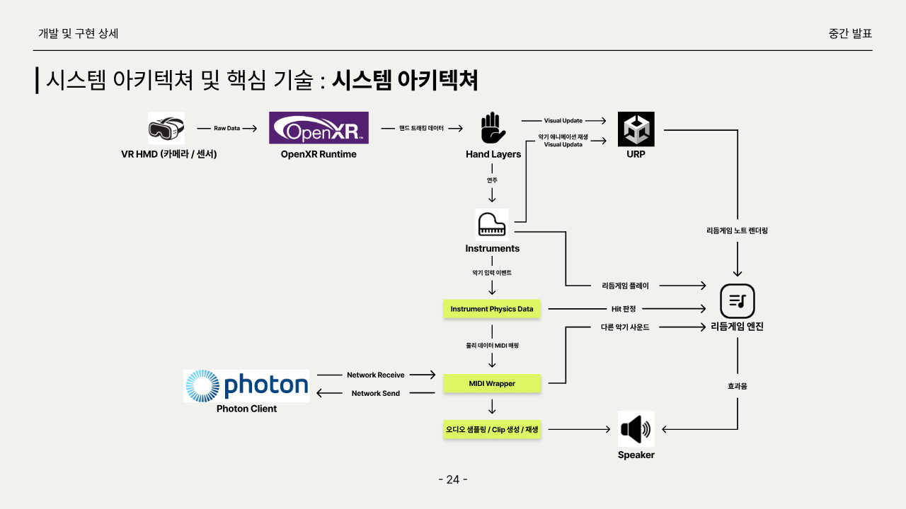

  <section class="hero">
    

      
Kookmin SW Capstone Design

      <h1>MU:RANG</h1>
      
연습실이 없어도, 악기가 없어도, 함께할 사람이 멀리 있어도 연주가 계속되는 VR 악기 연주 플랫폼

      

        <a href="#project">프로젝트 소개</a>
        <a href="#features">핵심 기능</a>
        <a href="#team">팀 소개</a>
      

    

  </section>

  <section id="project" class="section">
    
Why MU:RANG

    <h2>연주를 포기하게 만드는 것은 의지보다 환경입니다.</h2>
    

      MU:RANG은 MUsic과 유랑(RANG)을 결합한 이름입니다. 악기 연주를 배우고 싶지만 공간, 소음, 악기 구매 비용, 합주 인원 부족, 악보와 박자의 난이도 때문에 지속하지 못하는 사람들에게
      "누구나 즉시 즐길 수 있는 VR 연주 경험"을 제공하는 것이 목표입니다.
    

    

      

        <strong>공간의 한계 해소</strong>
        
가상 스튜디오에서 피아노, 드럼 등 여러 악기를 선택하고 소음 부담 없이 연주 경험을 시작합니다.

      

      

        <strong>학습 장벽 완화</strong>
        
리듬게임 방식의 노트 가이드와 판정 피드백으로 악보를 바로 읽기 어려운 사용자도 곡을 따라갈 수 있습니다.

      

      

        <strong>합주의 단절 해소</strong>
        
멀티플레이 기반 원격 합주를 통해 혼자 연습하던 사용자가 다른 연주자와 같은 공간감을 공유합니다.

      

    

  </section>

  <section class="section">
    
Midterm Feedback → Final Direction

    <h2>중간평가 피드백을 서비스 정의로 구체화했습니다.</h2>
    

      중간평가에서는 "VR기기를 활용한 악기 연주는 흥미롭고 참신하지만, 시장성과 서비스 구체성, 단계별 협주의 난이도 정의가 필요하다"는 피드백을 받았습니다.
      최종 발표 방향은 이 지점을 정면으로 보완합니다.
    

    

      <strong>타깃 구체화</strong>
      
메인 타깃은 악기를 배우고 싶지만 중단 경험이 있는 20대 초중반 사용자, 보조 타깃은 합주 경험은 있으나 시간·공간 제약을 느끼는 사용자로 정의했습니다.

    

    

      <strong>난이도 구체화</strong>
      
곡 선택 후 난이도를 고르고, 차트 파일을 기반으로 노트 생성·이동·판정·피드백이 이어지는 리듬게임 학습 흐름을 명확히 했습니다.

    

    

      <strong>시장 진입 구체화</strong>
      
마케팅 제안서는 "연주 유목민, 이제 정착할 시간"이라는 메시지 아래 인플루언서 시딩, 체험형 이벤트, SNS 확산 캠페인을 결합합니다.

    

  </section>

  <section id="features" class="section">
    
Service Structure

    <h2>가상 악기, 리듬게임, 원격 합주를 하나의 연주 경험으로 묶습니다.</h2>
    

      사용자는 가상 스튜디오에서 악기를 선택하고, 곡과 난이도를 고른 뒤 리듬게임 방식으로 연주합니다. 플레이어가 선택하지 않은 트랙은 자동 반주로 발화되어 한 명이 연주해도 곡 전체가 완성됩니다.
    

    

      <article class="feature">
        <figure></figure>
        

          <h3>다양한 악기 선택</h3>
          
스튜디오를 이동하며 악기를 선택하고, 선택한 악기에 맞는 입력·사운드·시각 피드백을 제공합니다.

        

      </article>
      <article class="feature">
        <figure></figure>
        

          <h3>리듬게임 연주 가이드</h3>
          
곡과 난이도 선택 후 노트 가이드를 따라 연주하며 Perfect, Good, Miss 판정으로 박자 정확도를 확인합니다.

        

      </article>
      <article class="feature">
        <figure></figure>
        

          <h3>멀티플레이 원격 합주</h3>
          
리듬게임 없이 자유롭게 합주하거나, 리듬게임 세션에서 여러 사용자가 각자의 파트를 맡아 협주할 수 있습니다.

        

      </article>
      <article class="feature">
        <figure></figure>
        

          <h3>MU:RANG 브랜드 경험</h3>
          
연주를 배우고 싶지만 떠돌던 사용자가 한 공간에 머물며 음악을 계속하게 만드는 경험을 지향합니다.

        

      </article>
    

  </section>

  <section class="section strategy-band">
    
Business & Marketing

    <h2>사업성은 "체험 → 공유 → 정착"의 흐름으로 설계합니다.</h2>
    

      최종 발표용 마케팅 제안서는 악기 연주 입문자, 음악 게임 사용자, VR 기반 개인 연습 사용자를 핵심 오디언스로 보고,
      MU:RANG을 "연주 시작의 가장 쉬운 진입점"으로 포지셔닝합니다.
    

    

      

        <h3>인지</h3>
        
연주·기타·VR 게임 크리에이터 협업으로 "이건 게임인가, 진짜 연주인가?"라는 호기심을 만듭니다.

      

      

        <h3>경험</h3>
        
영화관·체험관형 VR 콘서트 이벤트로 혼자가 아닌 연주 경험을 직접 느끼게 합니다.

      

      

        <h3>확산</h3>
        
포스트잇형 옥외 캠페인과 SNS 인증을 통해 "연주를 붙이다"라는 컨셉을 공유 행동으로 연결합니다.

      

      

        <h3>목표</h3>
        
제안서 초안 기준 총 노출 500만 회, QR 유입 5만 건, VR 체험 1.5만 건, SNS 게시물 5천 건을 캠페인 목표로 검토합니다.

      

    

  </section>

  <section class="section">
    
Technology

    <h2>핸드 트래킹과 사운드 파이프라인 위에 리듬게임 세션을 올립니다.</h2>
    

      Unity 6000.3.10f1, URP, OpenXR 기반으로 VR 입력을 처리하고, 악기 입력 이벤트를 MIDI 이벤트로 표준화해 사운드 엔진으로 전달합니다.
      리듬게임은 텍스트 차트 파일을 곡의 단일 진실원으로 삼아 노트 생성, 판정, 자동 반주를 구성합니다.
    

    <figure class="wide-figure">
      
      <figcaption>시스템 흐름: OpenXR 입력, 핸드 레이어, 악기 물리, MIDI 매핑, 사운드 엔진, 리듬게임 판정, 네트워크 동기화</figcaption>
    </figure>
  </section>

  <section id="video" class="section">
    
Demo Video

    <h2>소개 영상</h2>
    

      

        최종 발표용 시연 영상은 제작 중입니다. 영상이 완성되면 이 영역에 YouTube 또는 발표 데모 링크를 연결하고,
        현재 페이지의 서비스 화면·핵심 기능 설명과 함께 최종 산출물을 소개할 예정입니다.
      

    

  </section>

  <section id="team" class="section">
    
Team

    <h2>팀명은 밴드로 하겠습니다. 근데 이제 클래식을 곁들인</h2>
    
캡스톤 팀은 기획, 개발, 사운드, 그래픽, 멀티플레이, 마케팅을 나누어 MU:RANG을 만들고 있습니다.

    

      

        <strong>박하늘</strong>
        20211343
        
팀장·PM, 프로젝트 기획, 사운드 로직, 리듬게임 로직·악보 제작, 서류 작성

      

      

        <strong>권상혁</strong>
        20212958
        
프로젝트 기획, 핸드 트래킹, 컴퓨터 그래픽스, 악기 물리 상호작용, GitHub 총괄 관리

      

      

        <strong>허가림</strong>
        20223157
        
프로젝트 기획, 멀티플레이 구현, DB 연결, 서류 작성

      

      

        <strong>강태찬</strong>
        20251345
        
악기·플레이어·스튜디오 에셋 제작, 앱 아이콘 제작, PPT 디자인

      

      

        <strong>홍희성</strong>
        20190221
        
MU:RANG SNS 운영, SNS 광고 집행, 인플루언서 협찬, 펀딩·와디즈 운영, PPT 디자인

      

    

  </section>

  <section id="usage" class="section">
    
How To Run

    <h2>실행 방법</h2>
    

      

        <strong>1. 프로젝트 열기</strong>
        
Unity Hub에서 Unity 6000.3.10f1 환경으로 저장소를 열고 패키지 임포트가 끝날 때까지 기다립니다.

      

      

        <strong>2. 씬 실행</strong>
        
주요 씬은 <code>Assets/Scenes/SampleScene.unity</code>입니다. XR 장비 연결 후 에디터 또는 빌드에서 실행합니다.

      

      

        <strong>3. 연주 체험</strong>
        
가상 스튜디오에서 악기를 선택하고 곡·난이도를 고른 뒤 리듬게임 또는 합주 모드를 플레이합니다.

      

    

    

      <a href="https://github.com/kookmin-sw/2026-capstone-24">GitHub Repository</a>
      <a href="docs/specs/">Spec System</a>
    

  </section>

